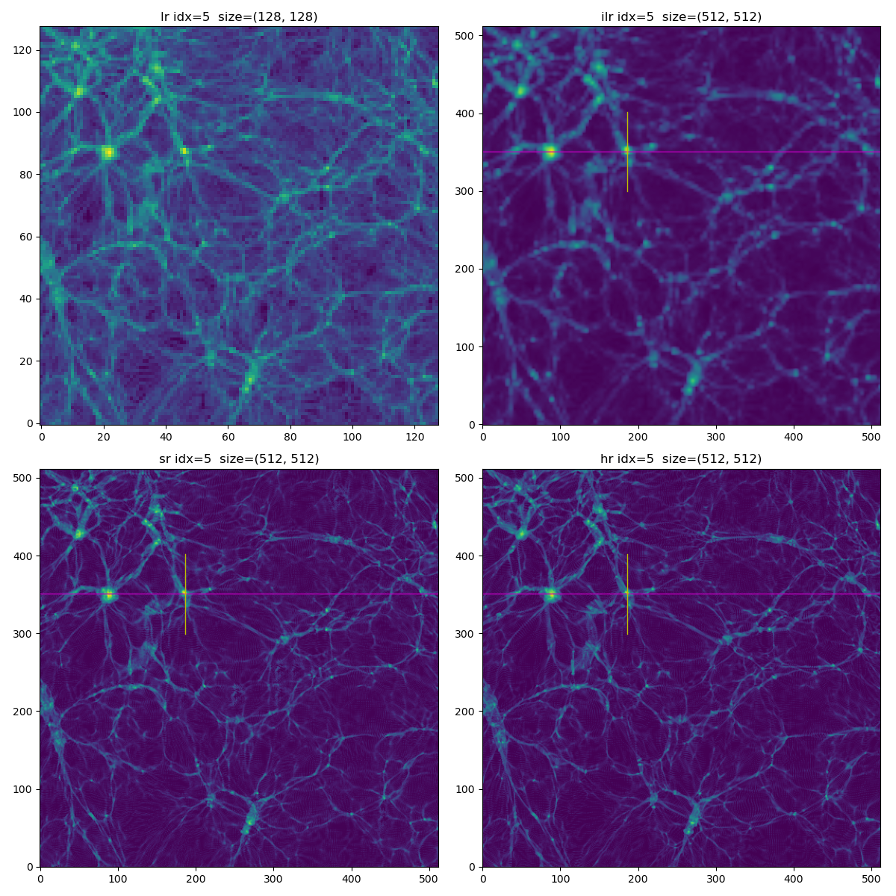
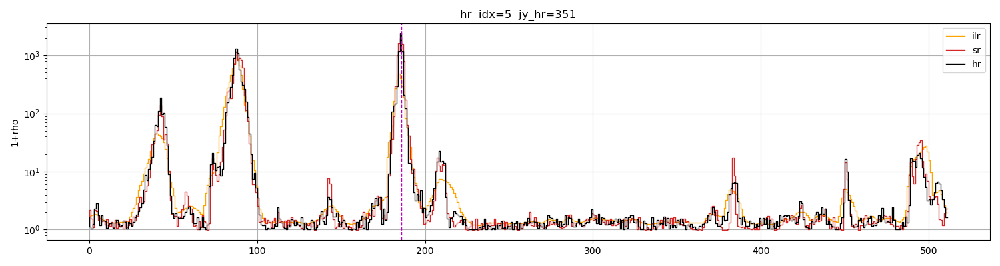
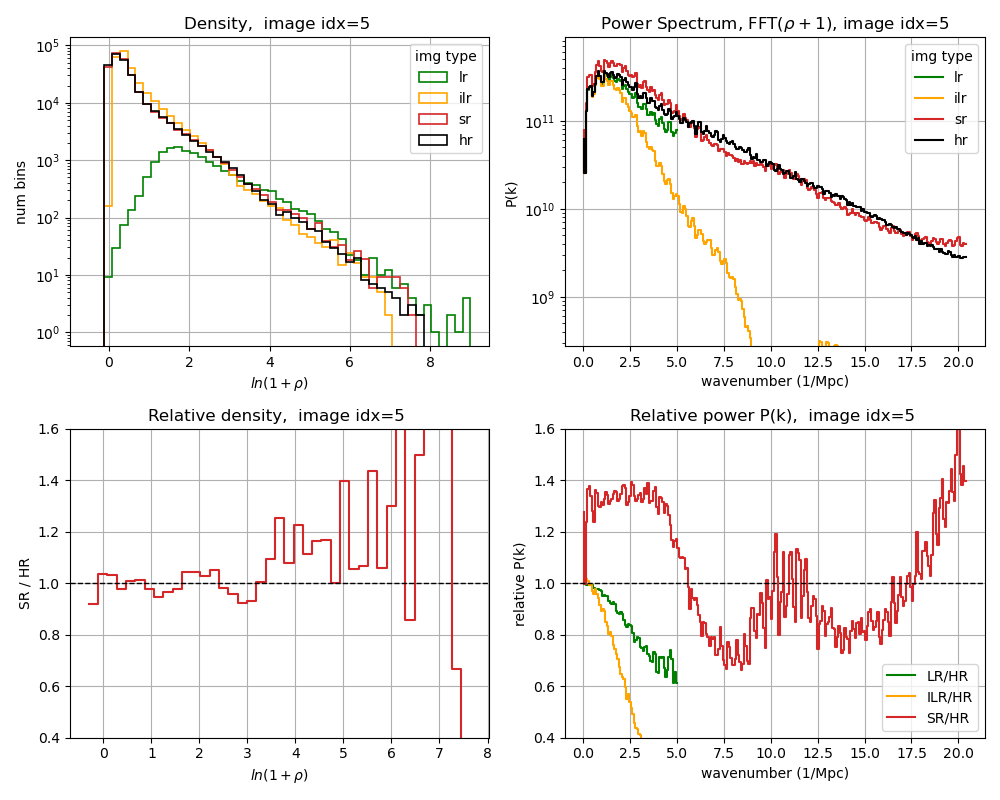

# srgan_cosmo2d 
Application SRGAN to enhance simulations of 2D distribution of dark matter in the Universe.
This code takes LR image of size 128^2 and generates SR image of size 512^2. HR is the ground truth high reolution image, ILR is interpolated LR image to 512^2.
The example below was obtaoined after 15 hour training on one A100.
  Fig. 1. Top: LR, ILR. Bottom: SR,HR. Magenta line defines 'skewer' which passes thrugh the brightest pixel on the HR image

  Fig. 2. Pixle intensity along the "skewer"
 

  Fig. 3. Denisty histogram and power spectrum. Top: absolute, bottom: relative
 
The code used here was derived from https://github.com/Lornatang/SRGAN-PyTorch
